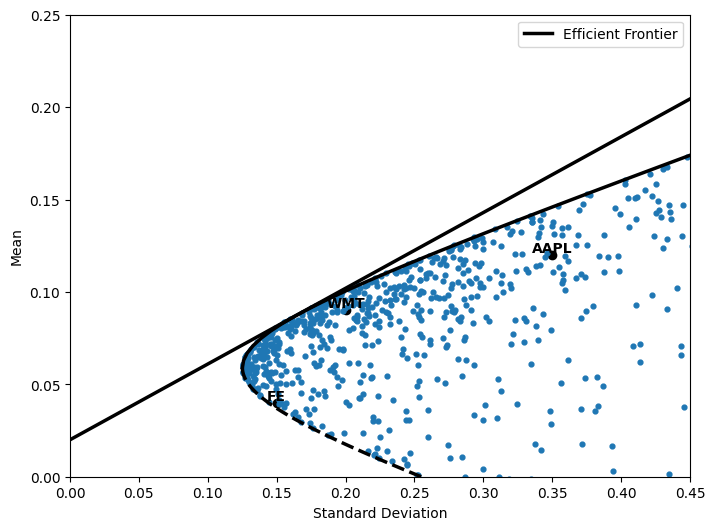

# Build a Robo-Advisor with Python (From Scratch)

Authors: Rob Reider, Alex Michalka

Manning: https://livebook.manning.com/book/build-a-robo-advisor-with-python-from-scratch

Book repo:  https://github.com/robreider/robo-advisor-with-python


# Efficient frontier



# Set up

Python 3.10

Installing dependencies:
```
$ python3.10 -m pip install yfinance
```

# Stochastic Calculus

## Multiplication in Stochastic Calculus: Specific Rules

1. **Product of two deterministic terms** \( dt \cdot dt \):
   \[
   (dt)^2 = 0
   \]

2. **Product of two stochastic terms** \( (dW_t)^2 \):
   \[
   (dW_t)^2 = dt
   \]

3. **Product of a deterministic and a stochastic term** \( dt \cdot dW_t \):
   \[
   dt \cdot dW_t = 0
   \]

## Ito's Lemma

This equation is a version of **Ito's Lemma** for a function of a stochastic process. It explains how to differentiate a function that depends on a stochastic process (e.g., a Brownian motion) with respect to time and the process itself.

Let’s break it down step by step:

\[
df(X_t, t) = \frac{\partial f}{\partial t} dt + \frac{\partial f}{\partial X_t} dX_t + \frac{1}{2} \frac{\partial^2 f}{\partial X_t^2} (dX_t)^2
\]

### Key Components of the Equation:

1. **\( df(X_t, t) \)**:
   This is the total differential of the function \( f(X_t, t) \), where \( f \) depends on both \( X_t \) (a stochastic process) and \( t \) (time). It tells us how the function \( f \) changes due to both the time evolution and the random fluctuations of \( X_t \).

2. **\( \frac{\partial f}{\partial t} dt \)**:
   This term represents the **deterministic change** of the function \( f \) with respect to time \( t \). It’s just the ordinary partial derivative of \( f \) with respect to time, multiplied by the infinitesimal time increment \( dt \). This term is the same as in standard calculus.

3. **\( \frac{\partial f}{\partial X_t} dX_t \)**:
   This term accounts for the change in the function \( f \) due to changes in the stochastic process \( X_t \). Here, \( dX_t \) is the stochastic increment (the change in \( X_t \)) over an infinitesimal time interval \( dt \). \( \frac{\partial f}{\partial X_t} \) is the partial derivative of \( f \) with respect to \( X_t \), so this term captures how \( f \) reacts to changes in the stochastic process.

4. **\( \frac{1}{2} \frac{\partial^2 f}{\partial X_t^2} (dX_t)^2 \)**:
   This is the most distinct term that appears in **stochastic calculus** (and not in regular calculus). It arises due to the fact that \( dX_t \), the change in the stochastic process, has a variance (randomness). The term \( (dX_t)^2 \) is not zero (unlike in regular calculus where infinitesimal terms of higher order are often neglected). Specifically, for a Wiener process \( W_t \), we know that:

   \[
   (dW_t)^2 = dt
   \]

   Therefore, this term reflects the **second-order variation** of the stochastic process, and the factor \( \frac{1}{2} \) is necessary due to this quadratic nature of the stochastic term.

### Understanding in Context:

- The first two terms, \( \frac{\partial f}{\partial t} dt \) and \( \frac{\partial f}{\partial X_t} dX_t \), resemble what you would expect from standard calculus, where you account for changes in the function due to time and due to the changing variable \( X_t \).

- The third term, \( \frac{1}{2} \frac{\partial^2 f}{\partial X_t^2} (dX_t)^2 \), is unique to stochastic processes. This term comes from the fact that stochastic processes like Brownian motion have non-zero quadratic variations, meaning they fluctuate randomly, and those fluctuations affect the function in a nonlinear way.

### A More Complete Example with Stochastic Process Substitution:

If we know that \( dX_t \) follows a stochastic differential equation like:

\[
dX_t = \mu(X_t, t) dt + \sigma(X_t, t) dW_t
\]

where \( \mu \) is the drift (deterministic trend) and \( \sigma \) is the diffusion (random component), then we substitute this into the above equation for \( dX_t \).

So,

\[
df(X_t, t) = \frac{\partial f}{\partial t} dt + \frac{\partial f}{\partial X_t} (\mu(X_t, t) dt + \sigma(X_t, t) dW_t) + \frac{1}{2} \frac{\partial^2 f}{\partial X_t^2} \sigma^2(X_t, t) dt
\]

This expanded form of Ito's Lemma explains how a function \( f(X_t, t) \) changes when \( X_t \) evolves according to a stochastic differential equation with both deterministic and random components.

Would you like a worked-out example applying this to a specific function?